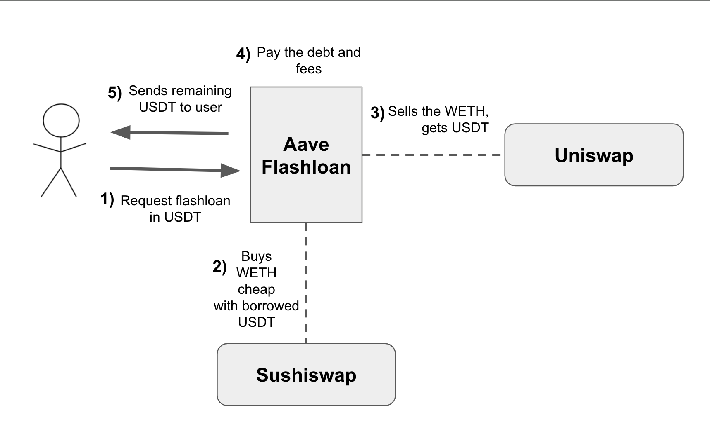

# Aave test

## Thank you for the opportunity to participate to join Aave, I hope you like it 🙏

## Description

For this challenge I created a contract that helps to execute the code to take advantage of an arbitrage opportunity.
To achieve this, I'm testing on a Hardhat fork of Ethereum Mainnet, and I'm using the liquidity pools WETH/USDT of the UniswapV2 and SushiswapV2 DEXs.
I'm simulating the arbitrage opportunity by impersonating a WETH whale that buys a lot of USDT using WETH on Sushiswap which has a lower TVL inside than the Uniswap pool. This part is simulating that many people decided to buy USDT using WETH on the Sushiswap pool, the general purpose is to make the price of USDT increase a lot in comparison to the price of WETH inside this Sushiswap pool. This could be very common on pools with a low liquidity, and it can happen with any token, the lower the liquidity the easier it is to see changes in the price like this.

To extract the value from this arbitrage opportunity I implemented an Aave V3 Flashloan Simple (20% gas reduction in flash loans compared to previous versions) to extract value from the difference between the price of the tokens in 2 DEXs.
The idea is that the extracted profit is used to pay for the flashloan and the remaining part is transferred to the user.

One caveat is that even if the sushiswap pool has a big difference in the price of their tokens, it's a better idea to trade the tokens obtained on different exchanges not only uniswap because otherwise we would be creating an arbitrage opportunity in another DEX, and we would also be losing tokens for the formula of x\*y=k.

All the logic mentioned above is inside the contract ArbitrageExecutor.sol

## What do we do now that we are rich thanks to our arbitration code? 💰

I think that it is important not only to make money, but also protect it from inflation or bad investments, so let's make our money grow by investing it on AaveV3. This is a simple investment since the USDT we have will be lended in AaveV3 so that other people can borrow it, these people will pay a commission that will partly be our profit. As considerations, USDT could not be used as collateral to borrow other tokens because Aavev3 does not allow it, also USDT on ethereum cannot use ERC20 permit because it does not support it, these 2 features could be implemented using a different token.

The users will have the ability to provide more USDT when they want or withdraw all his money.

All the logic mentioned above is inside the contract AaveInvestment.sol

## Why is this idea of Arbitration important?

Some DEXs rely on these arbitrators to stabilize the price of tokens within the pool and some stablecoins work using this concept that someone will make a profit when a pool has different values than expected, so these arbitrators will stabilize the price of the tokens across different DEXs.
Uniswap and Sushiswap V2 use the formula X\*Y=K to enforce that the more amount you buy of a token the more expensive it becomes, but this is not enough to prevent pool prices from becoming unbalanced across different DEXs.

Although this idea makes a lot of money, this process of finding arbitrage opportunities is complicated due to MEV bots watching the mempool and also due to competition with other people doing the same thing. There are several bots running to catch opportunities before you do it, when those MEV bots detect that your transaction will generate a lot of profit they will Frontrun it so that they can keep the profit for them.
Fortunately this flashloan will revert if the transaction does not get paid immediately, but the user will still need to pay for the blockchain fee of executing it.

## How to avoid MEV bots?

We noticed that the issue of simply executing this idea code in the ethereum mainnet is that MEV bots can steal the profit even if you did all the work of finding a good opportunity. To avoid this issue the user can execute the transaction using Flashbots, flashbots use a private mempool where no one can read the content of the transaction until it is processed, flashbots will also execute the transaction on the Ethereum Mainnet.

## Security considerations

I have seen some Defi investment strategies where the developer forges to consider the slippage tolerance when using an external protocol for swaps or adding liquidity. This contract allows the user to calculate the slippage tolerance for the transaction using a simple function. For this test it is not required because it is a forked network. The slippage tolerance helps to protect from MEV attackers, but also from simple users who execute their transactions before our transaction, for this it is a good idea to show the users what will be the minimum obtained tokens that they will get from the swaps, if the DEX returns less that the minimum tokens the transaction should be reverted.

## Code coverage 100%

## Gas reporter

## Security analysis

This project was tested with static security analysis tool called Slither with an extension for vscode.
The results show some warnings and informative bullet points, they were analyzed but they do not affect the desired behavior of the contract.
[Slither](https://github.com/crytic/slither) - Static analysis framework with detectors for many common Solidity issues.

## Notes

The contract layout was sorted according to the solidity docs [Functions Order](https://docs.soliditylang.org/en/v0.8.17/style-guide.html#order-of-functions) and [Layout Order](https://docs.soliditylang.org/en/v0.8.17/style-guide.html#order-of-layout). And following the [Naming convention.](https://docs.soliditylang.org/en/v0.8.17/style-guide.html#naming-conventions)

The code implements [Natspec documentation](https://docs.soliditylang.org/en/v0.8.17/natspec-format.html)

## How to run the tests

- Clone the repository
- Install the dependencies
- Run the in the terminal `npm run test`

## Where to find me

[Linkedin](https://www.linkedin.com/in/hanzel-anchia-mena/)

[Email](hanzelmgl98@gmail.com)

[Github](https://github.com/hanzel98)
